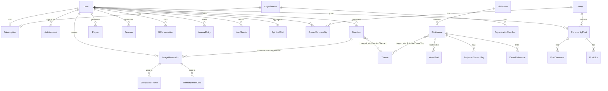

# 05 — Database Schema

**Database:** PostgreSQL 16+ | **ORM:** Prisma | **Source of truth file:** [`/faithgpt-platform/schema/schema.prisma`](../schema/schema.prisma)

This document explains the schema's structure, key design decisions, and how it maps to the feature set defined in §01 PRD, §00 Shared Reference, and §04 Feature Breakdown.

---

## 1. Design Principles

1. **Scripture is canonical and translation-independent.** `BibleVerse` represents a verse's identity (book/chapter/verse number); `VerseText` holds the rendered text per `BibleVersion`. All user interactions (highlights, notes, bookmarks, memory cards, cross-references, theme tags) point at `BibleVerse`, so they survive translation switches.
2. **AI outputs are structured but flexible.** Devotions, sermons, and scripture analysis store their generated content in `Json` columns following fixed schemas (documented in §00 and §18/§19) rather than dozens of narrow columns — this allows prompt/output evolution without migrations, while `passageKey`, `title`, `type`, `depth` remain real columns for querying/filtering.
3. **Cost & safety are first-class data.** Every AI call is logged in `AIUsageLog` (tokens, cost, latency, status) and every generated image carries a `moderationStatus` — required for the Admin Portal's AI Analytics, Financial Dashboard, and Image Generation Analytics (§17).
4. **Subscriptions are polymorphic across individuals and organizations.** `Subscription` can belong to either a `User` (Free/Plus/Premium/Lifetime) or an `Organization` (Ministry plans with seats), keeping billing logic unified (§11).
5. **Everything a user creates is retained for the Spiritual Journal & Growth Dashboard.** Devotions, prayers, sermons, images, and journal entries are all owned by `User` and cross-linked so "Save to Journal" and "Generate Matching Artwork" are simple FK relations, not new subsystems.

---

## 2. High-Level ERD (logical groups)

---

## 3. Table Groups & Purpose

| Group | Tables | Purpose |
|---|---|---|
| **Identity & Org** | `users`, `auth_accounts`, `refresh_tokens`, `organizations`, `organization_members` | Auth (§10), RBAC, Ministry org structure |
| **Billing** | `subscriptions`, `invoices` | Tier gating (§11), revenue reporting (§17) |
| **Bible Content** | `bible_versions`, `bible_books`, `bible_verses`, `verse_texts` | Multi-translation Bible (§04) |
| **Reading Plans** | `reading_plans`, `reading_plan_days`, `reading_plan_passages`, `user_reading_plans` | Plans & progress |
| **User Bible Interaction** | `highlights`, `notes`, `bookmarks`, `verse_history` | Personal study tools |
| **Scripture Analysis** | `themes`, `scripture_theme_tags`, `scripture_element_tags`, `scripture_analysis_cache` | Scripture Analysis Engine & Theme Discovery (§06, §18) |
| **Devotion Engine** | `devotions`, `devotion_themes`, `devotion_templates` | AI Verse-to-Devotion Engine™ (§18) |
| **Prayer Generator** | `prayers` | AI Prayer Generator |
| **Sermon Studio** | `sermons` | AI Sermon Assistant |
| **Bible Study Assistant** | `ai_conversations`, `ai_messages` | Conversational Q&A (§06) |
| **Visual Studio** | `image_generations`, `bible_story_visualizations`, `storyboard_frames`, `memory_verse_cards` | AI Scripture Image Generator™, Story Visualizer™, Memory Verse Visualizer™ (§19) |
| **Journal** | `journal_entries`, `prayer_requests` | Spiritual Journal |
| **Growth** | `user_streaks`, `spiritual_stats`, `achievements`, `user_achievements` | Spiritual Growth Dashboard™ |
| **Community** | `groups`, `group_memberships`, `community_posts`, `post_comments`, `post_likes`, `follows` | Christian Community |
| **Notifications** | `notifications` | Push/in-app notifications |
| **AI Ops & Moderation** | `ai_usage_logs`, `content_moderation_flags` | Admin AI Analytics & moderation (§17) |
| **Cross-References** | `cross_references` | Cross-Reference Engine |

---

## 4. Key Design Decisions

### 4.1 `passageKey` normalization
All AI-generated artifacts (`Devotion`, `Sermon`, `ImageGeneration`, `ScriptureAnalysisCache`) reference Scripture via a normalized string `passageKey`, e.g. `ROM.8.28-39` (Book.Chapter.VerseStart-VerseEnd). This:
- Enables a cache lookup in `scripture_analysis_cache` before calling the AI Gateway (cost control).
- Avoids modeling every possible passage range as a relational object.
- Is parsed into `bookId`/`chapterStart`/`verseStart`/etc. on `Devotion` for filtering/sorting in "My Devotions."

### 4.2 JSON columns for AI output
`Devotion.sections`, `Sermon.outline`, `ScriptureAnalysisCache.themes/elements` use `Json` because:
- The output schema is versioned via `DevotionTemplate.outputSchema` and may evolve (e.g., adding a new section) without a DB migration.
- The full structured object is rendered directly by the mobile UI (§16) — no server-side reshaping needed.
- Search/filter needs (by theme, type, depth) are covered by real columns and the `devotion_themes` join table, not by querying inside the JSON.

### 4.3 Soft polymorphism for `ImageGeneration`
An image can originate from a verse, chapter, story, devotion, prayer, sermon, memory verse, or custom prompt (`ImageSourceType`). Rather than a generic polymorphic FK (which Prisma doesn't support natively and which breaks referential integrity), we use **nullable typed FKs** (`devotionId`, `prayerId`, `sermonId`) for the cases that need relational integrity (Devotion Image Generator™, Sermon illustrations) plus a `sourceKey` string for verse/chapter/story/custom cases that resolve against Bible/story catalogs rather than DB rows.

### 4.4 Cost tracking precision
`AIUsageLog.costUsdMicros` stores cost as integer micro-dollars (1,000,000 = $1.00) to avoid floating-point drift across millions of rows — critical for the Financial Dashboard (§17) and per-user usage-based plan limits (§11).

### 4.5 Streak & stats as separate aggregates
`UserStreak` (one row per `StreakType`) and `SpiritualStat` (one row per user) are denormalized, incrementally-updated aggregates — written by application services on each qualifying event (chapter read, devotion generated, prayer logged) rather than computed via expensive aggregate queries on every dashboard load.

### 4.6 Moderation is queryable, not inferred
`CommunityPost.moderationStatus` and `ImageGeneration.moderationStatus` default to `APPROVED`/`PENDING` respectively (text posts auto-approved with reactive flagging via `ContentModerationFlag`; AI images are proactively screened before `APPROVED`). This split balances UX speed against AI-image risk (§12, §19).

---

## 5. Indexing Strategy (highlights)

- `bible_verses (bookId, chapter)` — fast chapter loads.
- `verse_texts (verseId, versionId)` unique — O(1) text lookup per version.
- `devotions (userId, createdAt)`, `prayers (userId, createdAt)`, `ai_conversations (userId, updatedAt)` — "My Library" feeds.
- `ai_usage_logs (feature, createdAt)` and `(userId, createdAt)` — admin analytics + per-user rate limiting windows.
- `image_generations (moderationStatus)` — moderation queue.
- `community_posts (groupId, createdAt)`, `(moderationStatus)` — feed pagination + moderation queue.
- `notifications (userId, isRead, createdAt)` — unread badge counts.

---

## 6. Data Lifecycle & Retention

| Data | Retention | Notes |
|---|---|---|
| Bible content, themes, cross-references | Permanent | Reference data, seeded |
| User-generated content (devotions, prayers, journal) | Permanent until user deletion | Exportable via "Download My Data" (§12) |
| `ai_usage_logs` | 24 months hot, then archived to cold storage (S3 Glacier) | Aggregated monthly summaries retained indefinitely |
| `refresh_tokens` | Deleted on logout/expiry; revoked rows purged after 30 days | |
| `content_moderation_flags` (resolved) | 12 months, then archived | Compliance/audit trail |
| `verse_history` | Rolling 90 days per user (older entries pruned by job) | Keeps "recently viewed" lightweight |

---

## 7. Seed Data Requirements

- `bible_books` (66 rows, canonical order/testament/chapter counts)
- `bible_versions` + `bible_verses` + `verse_texts` for at least KJV, WEB, ASV (public domain, offline-bundled) at launch; ESV/NIV/NLT added via licensed API sync jobs
- `themes` (15+ seed themes from §00 §9)
- `devotion_templates` (one active template per `DevotionType` × `DevotionDepth` = 78 combinations, prioritized rollout: Personal/Family/Youth/Children × Quick/Standard/Deep first)
- `achievements` (streak milestones: 7/30/100/365 days; "First Devotion", "First Image", "10 Memory Verses", etc.)
- `cross_references` (seeded from a licensed cross-reference dataset, e.g. Treasury of Scripture Knowledge — public domain)
