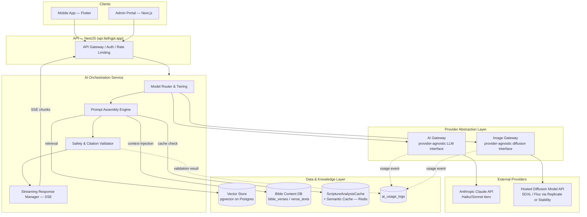

# 06 — AI Architecture

This document defines the system-level architecture for every AI capability in FaithGPT™: the AI Gateway and Image Gateway abstraction layers, model routing strategy, prompt engineering framework, the Retrieval-Augmented Generation (RAG) layer, caching/cost optimization, and the architectural enforcement of the AI Safety & Biblical Integrity rules defined in §01 PRD §8. It is the foundation for §18 (AI Devotion Engine Design) and §19 (AI Scripture Image Generator Design), and feeds the Admin Portal's AI Analytics and AI Usage Monitoring sections (§02 IA §2).

---

## 1. Architectural Principles

1. **No client or feature module talks to an LLM or image-generation provider directly.** The Flutter mobile app, the Admin Portal, and every backend module (`devotions`, `bible-study`, `prayers`, `sermons`, `images`) call an internal **AI Orchestration Service**, which in turn calls a **provider-agnostic AI Gateway** (text/chat models) or **Image Gateway** (diffusion models). This isolates provider choice, model version, and pricing from product code and allows provider swaps or multi-provider failover without touching feature modules.
2. **Every AI call is logged, costed, and attributable.** Every request — successful, failed, or moderation-blocked — produces exactly one `AIUsageLog` row (§00, schema). This is non-negotiable: it is the sole data source for the Admin Portal's AI Analytics, AI Usage Monitoring, and Financial Dashboard ("AI Cost vs Revenue").
3. **Model selection is a routing decision, not a hardcoded constant.** The AI Gateway selects a model based on `AIFeature`, `DevotionDepth` (where applicable), subscription tier, and a live feature-flag-controlled routing table — never a value baked into a prompt template.
4. **Scripture is data, not generation.** The AI Gateway never generates Scripture text. `verse_texts` rows are fetched from the Bible Content DB and injected into prompts as immutable context; the model is instructed to quote them verbatim and never paraphrase them as "Scripture."
5. **Every theological claim must be checkable.** All AI output that cites a reference is passed through a **Citation Validator** before being returned to the client — see §6.

---

## 2. High-Level System Architecture



**Flow summary:** Mobile/Admin → API → AI Orchestration Service, which assembles a prompt (injecting Scripture text from the Bible Content DB, RAG context from the vector store, and cache lookups), routes it through the AI Gateway or Image Gateway to the underlying provider, validates the output (safety + citations), and streams the result back to the client while writing an `AIUsageLog` row.

---

## 3. AI Gateway (LLM Abstraction)

The **AI Gateway** is a thin internal service/module (`src/modules/ai-gateway`) exposing a single interface regardless of upstream provider:

```ts
interface AIGatewayRequest {
  feature: AIFeature;            // DEVOTION, BIBLE_STUDY, PRAYER, SERMON, SCRIPTURE_ANALYSIS, ...
  modelTier: 'FAST' | 'CAPABLE';  // resolved by Model Router, not the caller
  systemPrompt: string;
  userPrompt: string;
  context?: RAGContext;           // injected Scripture + retrieved passages
  responseFormat: 'json' | 'text' | 'stream';
  maxTokens: number;
  userId?: string;
  metadata: { passageKey?: string; templateId?: string; templateVersion?: number };
}

interface AIGatewayResponse {
  content: string | AsyncIterable<string>; // text or SSE stream
  promptTokens: number;
  completionTokens: number;
  costUsdMicros: number;
  latencyMs: number;
  modelName: string;
  status: GenerationStatus;
}
```

Feature modules (Devotion Engine, Bible Study Assistant, Prayer Generator, Sermon Studio) never specify a model name — they specify `feature` and let the **Model Router** resolve `modelName`. This means a provider migration (e.g. a new Claude model generation) is a routing-table change, not a code change across five modules.

### 3.1 Provider: Anthropic Claude (Primary)

Claude is the sole LLM provider at MVP. The AI Gateway's Claude adapter wraps the Messages API and handles:

- System/user/assistant message construction from the assembled prompt.
- Streaming (`stream: true`) for all devotion, sermon, and chat responses.
- Structured output enforcement (JSON schema instructions + post-parse validation — see §5).
- Retry/backoff on transient errors, and provider error mapping to `GenerationStatus.FAILED`.

### 3.2 Model Routing

The Model Router selects between a **faster/cheaper model tier** and a **more capable model tier** based on `AIFeature`, `DevotionDepth`, `AIQuestionCategory`, and the user's `SubscriptionTier`:

| Trigger | Routed Tier | Rationale |
|---|---|---|
| `DevotionDepth = QUICK` or `STANDARD` | **FAST** (e.g. Claude Haiku family) | High volume, short output, cost-sensitive — these are the bulk of devotion generations |
| `DevotionDepth = DEEP`, `ADVANCED`, `TEACHING`, `SERMON` | **CAPABLE** (e.g. Claude Sonnet/Opus family) | Longer, theologically denser output; Advanced requires original-language notes |
| AI Bible Study Assistant — `AIQuestionCategory` in `{HEBREW_ORIGINAL, GREEK_ORIGINAL, CHRIST_CONNECTION, CROSS_REFERENCES}` | **CAPABLE** | Requires deeper reasoning over original languages and typology |
| AI Bible Study Assistant — all other categories, general chat | **FAST** | Conversational latency matters more than maximal depth |
| AI Sermon Assistant (all outputs) | **CAPABLE** | `SERMON`-depth content by definition |
| AI Prayer Generator | **FAST** | Short, formulaic output |
| Scripture Analysis Engine | **FAST** | High-frequency, cacheable, short structured output |

Routing is implemented as a configuration table (admin-editable feature flag, not a redeploy) so the platform can shift cost/quality trade-offs as Claude model pricing and capability evolve. The router additionally considers `SubscriptionTier`: Free-tier requests to `DEEP`+ depths that exceed quota are rejected by the API layer before reaching the Orchestration Service (see §11 Subscription System), so the router never needs to "downgrade" a paid user's request — it only ever selects the tier appropriate to the requested depth/category.

---

## 4. Image Gateway (Diffusion Model Abstraction)

The **Image Gateway** (`src/modules/image-gateway`) mirrors the AI Gateway's design for image generation, used by the AI Scripture Image Generator™, AI Bible Story Visualizer™, Memory Verse Visualizer™, and Devotion Image Generator™ (full pipeline in §19).

```ts
interface ImageGatewayRequest {
  style: ImageStyle;
  refinedPrompt: string;          // fully constructed prompt (post safety screening)
  negativePrompt?: string;
  aspectRatio: string;            // resolved from MemoryCardFormat or style default
  loraAdapter?: string;           // e.g. "faithgpt-christian-artwork-v2"
  userId: string;
  metadata: { sourceType: ImageSourceType; sourceKey: string };
}

interface ImageGatewayResponse {
  imageUrl: string;
  thumbnailUrl: string;
  modelName: string;
  costUsdMicros: number;
  latencyMs: number;
  status: GenerationStatus;
}
```

The provider is a **hosted diffusion model API** (e.g. Stable Diffusion XL or Flux, accessed via Replicate or the Stability AI API). Routing by `ImageStyle` (including the optional fine-tuned LoRA adapter for `CHRISTIAN_ARTWORK`) is detailed in §19 §6. The Image Gateway is also the enforcement point for the watermark/labeling pipeline (§19 §5) and writes its own `AIUsageLog` row with `feature = IMAGE_GENERATION`.

---

## 5. Prompt Engineering Framework

### 5.1 Prompt Anatomy

Every AI Gateway call is assembled from four layers by the **Prompt Assembly Engine**:

| Layer | Source | Purpose |
|---|---|---|
| **1. System Prompt** | `DevotionTemplate.systemPrompt` (or feature-equivalent for Bible Study/Prayer/Sermon) | Defines role, tone, output format, citation rules, and Biblical Integrity constraints (§6) |
| **2. Context Injection** | Bible Content DB (`verse_texts`) + RAG layer (§5.3) + `ScriptureAnalysisCache` | Injects the literal Scripture passage (verbatim, from the user's selected `versionCode`), Scripture Analysis themes/elements, and retrieved commentary excerpts |
| **3. User Prompt** | User selections (Theme Discovery picks, `DevotionType`, `DevotionDepth`, question text, prayer topic, etc.) | The "what the user is asking for" |
| **4. Output Contract** | `DevotionTemplate.outputSchema` (or equivalent JSON schema per feature) | Machine-readable shape the model must return — validated post-generation |

### 5.2 `DevotionTemplate` Versioning & A-B Testing

`DevotionTemplate` (schema: `devotion_templates`) is the canonical store for devotion prompt templates, keyed by `(type, depth, version)` with `isActive` flag. This enables:

- **Versioning**: a new `version` row can be created for a `(type, depth)` pair without breaking devotions already generated under the prior version (the `Devotion.generationParams` JSON records which `templateId`/`version` produced it, for reproducibility and audit).
- **A-B testing**: two `isActive = true` versions of the same `(type, depth)` can coexist; the Orchestration Service assigns a deterministic variant per user (hash of `userId` + `templateId`) and records the chosen `templateId`/`version` in `generationParams` and `AIUsageLog.metadata` (conceptually — surfaced in Admin AI Analytics as "Prompt Versioning / A-B Testing," §02 IA §2).
- **Rollback**: deactivating a version (`isActive = false`) and reactivating a prior version is an Admin Portal action with no deploy required (Devotion Template Management, §02 IA §2).

Full template inheritance strategy (base template + per-type/per-depth overlays, the 13×6 = 78 combination matrix) is detailed in §18 §4.

### 5.3 RAG Layer

FaithGPT grounds AI output — devotion theological insights, Bible Study Assistant answers, sermon illustrations — in a retrieval layer rather than relying purely on model parametric knowledge:

- **Vector store**: **pgvector extension on the primary PostgreSQL 16+ instance** (co-located with the rest of the schema for MVP scale; architecture allows migration to a dedicated vector DB such as Pinecone/Weaviate at Phase 2+ scale without changing the retrieval interface). A new `knowledge_chunks` table (Phase 1 addition, documented alongside §05) stores `(content, embedding vector(1536), sourceType, sourceRef, license)`.
- **Indexed content**: public-domain and licensed Bible commentaries, study notes, cross-reference data (`cross_references`), and theological/topical resources curated by the Content Editor role.
- **Retrieval flow**: the Prompt Assembly Engine embeds the user's passage/question, performs a similarity search (`pgvector` cosine distance) scoped to the relevant `passageKey`/theme, and injects the top-k chunks into Context Injection (Layer 2) as "Reference material (for grounding only — do not present as Scripture)."
- **Grounding, not generation source**: retrieved chunks inform the model's reasoning and let it produce citation-backed claims (e.g. "many commentators note that Romans 8:28 was written to a persecuted church — see [Reference]"), but the model is instructed to synthesize in its own words and never to copy commentary verbatim as if it were Scripture.

### 5.4 Context Injection Example

For the Verse-to-Devotion Engine (full worked example in §18), Context Injection assembles:

```
[SCRIPTURE — versionCode: ESV, passageKey: ROM.8.28-39]
28 And we know that for those who love God all things work together for good...
...
39 ...nor anything else in all creation, will be able to separate us from the love of God in Christ Jesus our Lord.

[SCRIPTURE ANALYSIS — from ScriptureAnalysisCache, passageKey: ROM.8.28-39]
Themes: Trusting God's Plan, Purpose Through Pain, Hope During Difficult Times,
        God's Sovereignty, Faith Under Pressure, Spiritual Perseverance
Biblical Elements: PROMISE (v28), BLESSING (v31-39)

[USER SELECTIONS]
Selected themes: Purpose Through Pain, God's Sovereignty
DevotionType: PERSONAL
DevotionDepth: STANDARD

[RAG CONTEXT — top 3 retrieved chunks, similarity > 0.78]
1. (Commentary excerpt on Romans 8:28, public domain) ...
2. (Cross-reference note: Romans 8:28 ↔ Genesis 50:20) ...
3. (Topical resource: "Suffering and Sovereignty in Paul's theology") ...
```

---

## 6. AI Safety & Biblical Integrity Enforcement

The architecture enforces every rule in §01 PRD §8 at multiple layers — not solely via prompt instructions, which are necessary but not sufficient.

| PRD §8 Rule | Architectural Enforcement |
|---|---|
| 1. Scripture never AI-paraphrased | Scripture is fetched from `verse_texts` and injected as immutable, quoted context. The Output Structuring step (§18 §1) verifies that any `keyScripture`/`relatedScriptures` fields match `verse_texts` content rather than model-generated text. |
| 2. AI commentary visually distinguished ("AI-Generated Insight") | A `aiGenerated: true` flag and section-level metadata are part of every devotion/answer payload returned by the Orchestration Service; mobile renders the badge per §15 UI spec. This is a contract enforced by the Output Contract (Layer 4, §5.1) — sections are never returned without it. |
| 3. Every theological claim cites Scripture | System prompts (Layer 1) mandate inline citations in a structured `[Book Chapter:Verse]` format for theological-insight sections. The **Citation Validator** (below) is a hard gate. |
| 4. Hedging language for disputed topics | System prompts include a "disputed topics" instruction set (e.g. eschatology, spiritual gifts, end-times timelines) requiring phrases like "many scholars believe..." / "one interpretation holds...". The Safety Validator runs a lightweight classifier pass on flagged topic categories and can reject/regenerate output missing hedging markers. |
| 5. Denomination-neutral default + "Lens" override | The base system prompt is denomination-neutral. If `User.denominationLens` is set (e.g. `SDA`, `CATHOLIC`, `REFORMED`, `PENTECOSTAL`), the Prompt Assembly Engine appends a **Lens Overlay** — a supplementary instruction block that may adjust framing of secondary material (e.g. Sabbath School framing for SDA) but is explicitly forbidden (by prompt instruction + Output Structuring check) from altering `keyScripture` text. |
| 6. AI images watermarked/labeled + content-safety filter | Enforced in the Image Gateway pipeline; see §19 §5 and §19 §3 (Content Safety Filter). |
| 7. Devotion flows open with full passage before AI commentary | Enforced at the Output Structuring step: `keyScripture` is always section #2 (after `title`) and is populated from `verse_texts`, never omitted — validated before persistence. |

### 6.1 Citation Validator

Every AI Gateway response destined for the user (devotion sections, Bible Study Assistant answers, sermon content) passes through the **Safety & Citation Validator** before the Streaming Response Manager emits it:

1. **Extraction**: parse all Scripture references (`Book Chapter:Verse[-Verse]`) out of the model's structured output using a reference-pattern parser.
2. **Existence check**: for each extracted reference, query `bible_books` + `bible_verses` to confirm the book/chapter/verse combination exists (catches hallucinated references like "3 Corinthians" or "Romans 8:45" in a 39-verse chapter).
3. **Outcome**:
   - **Valid** → reference is passed through, optionally hyperlinked client-side to the Bible Reader (`faithgpt://bible/<book>/<chapter>/<verse>`).
   - **Invalid** → the offending section is flagged; for `STANDARD`+ depths the Orchestration Service triggers a single automatic regeneration of that section with an added corrective instruction ("the reference X does not exist — verify against canonical 66-book Scripture"); if the second attempt also fails validation, the reference is stripped and the section is logged with `status = FAILED` partial-flag in `AIUsageLog` for admin review.
4. The validator does **not** verify theological correctness of claims (that is a human review responsibility — §18 §5 Quality Assurance) — it strictly verifies that **cited references are real, addressable Scripture locations**.

---

## 7. Caching & Cost Optimization

| Cache | Backing Store | Scope | Purpose |
|---|---|---|---|
| **Scripture Analysis Cache** | `scripture_analysis_cache` (Postgres) | Keyed by `passageKey` + `versionCode` | Avoids re-running theme/element detection for the same passage — the same `ROM.8.28-39` analysis is reused across every user who selects that passage |
| **Semantic Cache (Bible Study Assistant)** | Redis + pgvector similarity lookup on question embeddings | Keyed by embedding similarity to prior questions on the same `passageKey`/`AIQuestionCategory` | Repeated or rephrased questions ("what does this verse mean?" vs "can you explain this verse?") on the same passage return a cached structured answer above a similarity threshold (e.g. ≥ 0.92), with a freshness window (e.g. 30 days) before re-generation |
| **Model tiering by subscription tier & `DevotionDepth`** | Model Router config | Per-request | The primary cost lever — Free/Plus traffic is concentrated on `QUICK`/`STANDARD` (FAST tier); `DEEP`+ usage is both rate-limited by subscription quota (§11) and routed to CAPABLE tier only when actually requested |
| **Image result cache** | `image_generations.resultUrl` + CDN | Keyed by `(sourceKey, style, refinedPrompt hash)` | Identical regenerate requests (e.g. re-opening a saved devotion's "Generate Matching Artwork") serve the existing CDN asset rather than re-invoking the Image Gateway |

Cache hits **still** produce an `AIUsageLog` row (with `promptTokens = 0`, `completionTokens = 0`, `costUsdMicros = 0`, `status = COMPLETED`, and a `modelName` value such as `"cache:scripture-analysis"`) so the Admin AI Analytics dashboard can report cache-hit rate as a cost-savings metric, not just raw spend.

---

## 8. Streaming & Response Delivery

The **Streaming Response Manager** exposes Server-Sent Events (SSE) over the API Gateway for all long-form generations (devotions, sermons, Bible Study Assistant chat replies). For the Devotion Engine specifically, output is streamed **section-by-section** against the canonical 15-section schema (§00 §8) so the client renders progressively rather than waiting for the full ~400-2500 word output — full streaming protocol detailed in §18 §6.

Image generation (Image Gateway) is not streamed (diffusion models do not support token streaming); instead the client polls or subscribes to a WebSocket/SSE status channel keyed on `ImageGeneration.id`, transitioning `PENDING → PROCESSING → COMPLETED/FAILED/MODERATION_BLOCKED` (`GenerationStatus`).

---

## 9. AI Usage Logging

Every call through the AI Gateway or Image Gateway — regardless of outcome — writes one `AIUsageLog` row:

```ts
{
  userId,            // nullable for system-generated/background jobs
  feature,           // AIFeature enum
  modelName,         // e.g. "claude-haiku-4-5", "claude-sonnet-4-6", "sdxl-1.0"
  promptTokens,
  completionTokens,
  costUsdMicros,     // computed from provider pricing table at call time
  latencyMs,
  status,            // GenerationStatus
  createdAt,
}
```

This table is the sole source for:

- **AI Analytics** (§02 IA §2): usage by feature, by tier (joined via `users.subscription`), by user; quality feedback rates (joined with thumbs-up/down events stored alongside `Devotion`/`Prayer`/`Sermon` — see §17 Admin Portal Design).
- **AI Usage Monitoring**: real-time request volume, latency percentiles (P50/P95/P99), error rates, and cost-alert thresholds — computed via rolling aggregates over `ai_usage_logs`.
- **Financial Dashboard — "AI Cost vs Revenue"**: `costUsdMicros` aggregated by time period and tier, compared against `invoices`/`subscriptions` revenue.

`latencyMs` is measured end-to-end from Orchestration Service dispatch to first-byte-of-final-validated-output (for streamed responses, to stream completion), so it reflects user-perceived latency including the Safety & Citation Validator pass, not just raw provider latency.

---

## 10. Summary of Cross-References

| Topic | Detailed in |
|---|---|
| Devotion pipeline, template inheritance, streaming sections | §18 — AI Devotion Engine Design |
| Image pipeline, styles, moderation queue, watermarking | §19 — AI Scripture Image Generator Design |
| Subscription-based quotas feeding the Model Router | §11 — Subscription System |
| Admin AI Analytics / Usage Monitoring screens | §17 — Admin Portal Design |
| Database schema for all referenced models | §05 — Database Schema, `/faithgpt-platform/schema/schema.prisma` |
