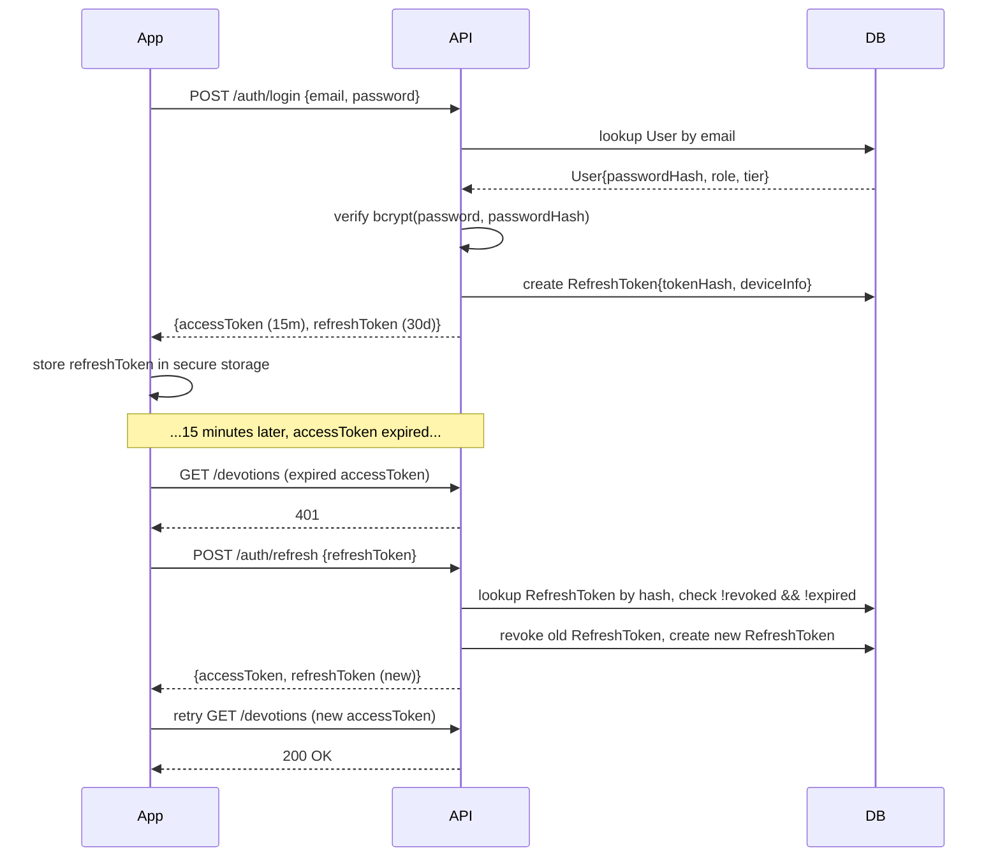
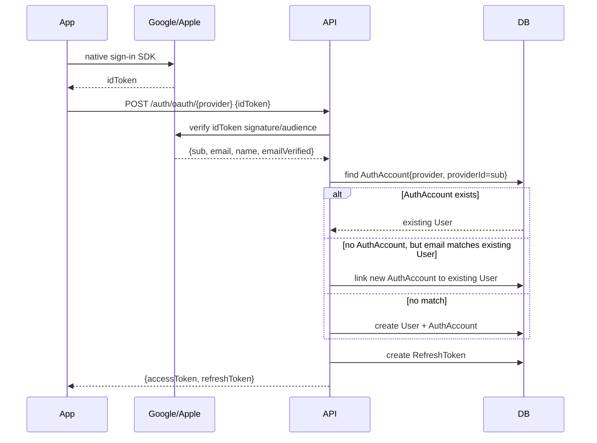

# 10 — Authentication System

---

## 1. Authentication Methods

| Method | `AuthProviderType` | Notes |
|---|---|---|
| Email + password | `PASSWORD` | bcrypt/argon2 hash in `User.passwordHash`; min 10 chars, breach-list check on signup |
| Google Sign-In | `GOOGLE` | OAuth 2.0 / OIDC, mobile native SDK + web fallback for Admin Portal |
| Apple Sign-In | `APPLE` | Required for iOS App Store compliance (any 3rd-party login ⇒ Apple Sign-In must be offered) |
| Facebook Login | `FACEBOOK` | OAuth 2.0 |
| Phone OTP | `PHONE_OTP` | Twilio Verify; primary method for markets where email adoption is low (e.g. Ghana/West Africa) |

A `User` may link multiple `AuthAccount` rows (e.g., started with Phone OTP, later linked Google) — account linking is by verified email/phone match, with a confirmation step if the identifiers don't already match.

---

## 2. Token Model

| Token | Lifetime | Storage | Notes |
|---|---|---|---|
| Access token (JWT) | 15 minutes | Memory / Riverpod state (not persisted) | Contains `sub` (userId), `role`, `tier`, `iat`, `exp` |
| Refresh token | 30 days | `refresh_tokens` table (hashed), client: `flutter_secure_storage` | Rotated on every use (old token revoked, new issued); `deviceInfo` recorded |

- On `401` from any API call, the mobile `ApiClient` auth interceptor calls `POST /api/v1/auth/refresh` with the stored refresh token, retries the original request once, and force-signs-out on a second failure.
- Refresh token rotation: each refresh **revokes** the prior `refresh_tokens` row (`revokedAt` set) and issues a new one — limits replay-attack window if a token is exfiltrated.
- Revoked rows are purged after 30 days (§05 §6 retention).

---

## 3. Session & Device Management

- **Account → Active Sessions** lists all non-revoked `refresh_tokens` rows for the user, showing `deviceInfo` (device model, OS, last-used timestamp).
- Users can revoke any session individually ("Log out this device") or all sessions ("Log out everywhere" — e.g. after a password change, which automatically revokes all refresh tokens).

---

## 4. Mobile Biometric Unlock

Biometric unlock (Face ID / Touch ID / Android Fingerprint, via `local_auth`) is a **local app-lock**, not a second server-side factor:

1. On successful login, the refresh token is stored in `flutter_secure_storage`.
2. If the user enables "App Lock" in Settings, app resume from background requires biometric (or device PIN fallback) verification before the stored token is read and used to obtain a fresh access token.
3. No server-side state changes — this purely protects a shared/lost device from accessing an already-authenticated session.

---

## 5. RBAC — Role → Access Matrix

| Role | Mobile app access | Admin Portal access |
|---|---|---|
| `USER` | Full mobile app per subscription tier (§11) | None |
| `GROUP_LEADER` | All `USER` access + create/manage Community Groups | None |
| `MINISTRY_ADMIN` | All `USER` access + Org Console (seat management, org analytics) within mobile app | None |
| `MODERATOR` | Standard `USER` mobile access | Content Moderation, Community Moderation sections only |
| `CONTENT_EDITOR` | Standard `USER` mobile access | Devotion Template Management, Bible Translation Management, Notification Center |
| `SUPPORT` | Standard `USER` mobile access | User Management (read-only + limited actions: resend verification, view subscription status) |
| `ADMIN` | Standard `USER` mobile access | All sections except Settings → Admin Roles & Audit Log |
| `SUPER_ADMIN` | Standard `USER` mobile access | Full access incl. Admin Roles & Permissions, Audit Log, Feature Flags |

Enforcement: NestJS `RolesGuard` (§08) reads `@Roles(...)` decorator metadata against `User.role` from the JWT; Admin Portal routes additionally check role server-side on every API call (never trust client-side route guards alone).

---

## 6. Account Verification

- **Email verification**: signup sends a verification link (`/api/v1/auth/verify-email?token=...`, single-use, 24h expiry) → sets `User.emailVerifiedAt`. Unverified accounts have full app access (avoids onboarding friction) but cannot post to Community or use Phone OTP recovery until verified.
- **Phone verification**: Twilio Verify OTP (6-digit, 10-minute expiry, 5 attempts max) for `PHONE_OTP` signups and for adding a phone number to an existing account.

---

## 7. Password Reset Flow

1. `POST /api/v1/auth/password-reset/request` (email) → always returns 202 (no account-existence leakage) → if account exists, emails a single-use reset token (1h expiry).
2. `POST /api/v1/auth/password-reset/confirm` (token + new password) → updates `passwordHash`, revokes **all** existing `refresh_tokens` for the user (forces re-login on all devices), sends a confirmation email.

---

## 8. Sequence Diagrams

### 8.1 Email/Password Login + Refresh Rotation

### 8.2 OAuth (Google/Apple) Sign-In

---

## 9. Admin Portal Authentication

- Separate login surface at `admin.faithgpt.app/login` — same `users` table, but only roles `MODERATOR`, `CONTENT_EDITOR`, `SUPPORT`, `ADMIN`, `SUPER_ADMIN` may authenticate here (others receive `403 Forbidden`).
- **MFA (TOTP)** is mandatory for `ADMIN` and `SUPER_ADMIN` — enforced at login: password success → TOTP challenge → tokens issued. Optional (but encouraged) for `MODERATOR`/`CONTENT_EDITOR`/`SUPPORT`.
- Admin sessions use the same JWT access/refresh model but with a shorter refresh lifetime (7 days) and IP-change re-authentication prompt.
- All admin authentication events and role changes are written to the audit log (§12 §9).
