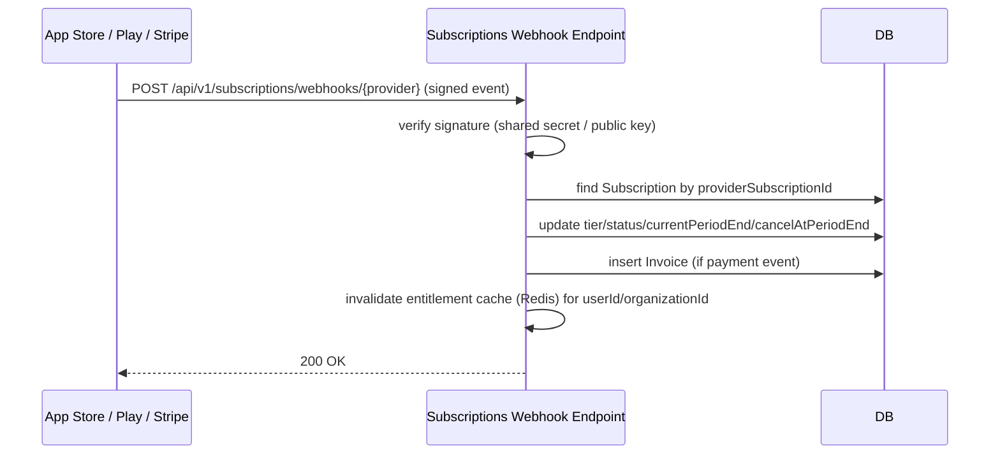

# 11 — Subscription System

---

## 1. Tier Pricing

| Tier | Code | Monthly | Annual | Trial | Notes |
|---|---|---|---|---|---|
| Free | `FREE` | $0 | — | — | Full Bible + taste of AI |
| Plus | `PLUS` | $4.99 | $39.99 (33% off) | 7 days | Daily devotional users |
| Premium | `PREMIUM` | $9.99 | $79.99 (33% off) | 7 days | Power users, creators, leaders |
| Ministry | `MINISTRY` | from $49.99 (5 seats) | from $499/yr | — | Seat-based, churches/orgs |
| Lifetime | `LIFETIME` | — | $199.99 one-time | — | Early-adopter / promo |

Ministry pricing scales: $49.99/mo base (5 seats) + $7.99/seat/mo beyond 5, billed via Stripe invoicing (annual contracts available at 2 months free).

---

## 2. Feature-Gating Matrix (numeric quotas)

| Capability | FREE | PLUS | PREMIUM | MINISTRY |
|---|---|---|---|---|
| Bible versions offline | 1 (public domain) | Unlimited | Unlimited | Unlimited |
| Audio Bible | — | ✓ | ✓ | ✓ |
| Parallel translation view | — | ✓ | ✓ | ✓ |
| AI Bible Study Assistant questions | 5/day | 50/day | Unlimited | Unlimited |
| Question categories available | Meaning, Simple, Modern (3 of 11) | All 11 | All 11 | All 11 |
| Conversation history retention | 7 days | 90 days | Unlimited | Unlimited |
| Devotion types available | Personal, Family, Youth, Children (4 of 13) | +Women, Men, Marriage, Evangelistic (8 of 13) | All 13 | All 13 |
| Devotion depth: Quick/Standard | Unlimited | Unlimited | Unlimited | Unlimited |
| Devotion depth: Deep | 3/month | Unlimited | Unlimited | Unlimited |
| Devotion depth: Advanced | — | 5/month | Unlimited | Unlimited |
| Devotion depth: Teaching/Sermon Mode | — | — | Unlimited | Unlimited |
| Per-section regenerate | — | ✓ | ✓ | ✓ |
| AI Prayer Generator uses | 5/day | Unlimited | Unlimited | Unlimited |
| Prayer types available | 4 of 9 | All 9 | All 9 | All 9 |
| Sermon Studio | — | — | ✓ | ✓ |
| Image generations | 5/month | 50/month | Unlimited | Unlimited (pooled across seats) |
| Image styles available | 3 of 10 | All 10 | All 10 | All 10 |
| AI-Generated visible watermark | Always on | Always on | Optional off (metadata label always retained) | Optional off |
| Bible Story Visualizer | — | ✓ (Storyboard, Children's Book) | ✓ (+Comic, Teaching Slides) | ✓ |
| Memory Verse Visualizer formats | Flashcard, Wallpaper (2 of 5) | All 5 | All 5 | All 5 |
| Christian Content Creator™ | — | — | ✓ | ✓ + brand kit |
| Reading plan library | Limited (5 plans) | Full library | Full library | Full library + custom org plans |
| Journal export (PDF) | — | ✓ | ✓ | ✓ |
| Create Community groups | — | ✓ | ✓ | ✓ + org-wide groups |
| Org Console / seat management | — | — | — | ✓ |
| Group/org growth analytics | — | — | — | ✓ |

Quotas reset on a rolling basis (daily quotas reset at user's local midnight; monthly quotas reset on subscription anniversary for paid tiers, calendar month for Free).

---

## 3. Payment Providers

| Provider | `BillingProvider` | Use case |
|---|---|---|
| Apple In-App Purchase | `APPLE_IAP` | iOS subscriptions (Plus/Premium/Lifetime) |
| Google Play Billing | `GOOGLE_PLAY` | Android subscriptions |
| Stripe | `STRIPE` | Web checkout, Ministry invoicing/contracts |
| Paystack | `PAYSTACK` | West Africa — mobile money & local cards (Ghana, Nigeria) for Plus/Premium where IAP pricing/availability is limited |
| Manual | `MANUAL` | Admin-granted comps, press/partner accounts |

App Store/Play Store policies require digital subscription purchases to go through IAP/Play Billing on those platforms; Stripe/Paystack are used for web signup and Ministry contracts (B2B, outside store policy scope).

---

## 4. Billing Cycles & Trials

- Monthly or annual (33% effective discount) for `PLUS`/`PREMIUM`.
- 7-day free trial for first-time `PLUS`/`PREMIUM` subscribers (`Subscription.trialEndsAt`); one trial per payment-method/device fingerprint to limit abuse.
- `LIFETIME`: one-time payment, `status=ACTIVE` indefinitely, `currentPeriodEnd=null`. Entitlement checks treat `LIFETIME` as always-current regardless of period fields.
- `cancelAtPeriodEnd=true` keeps full access until `currentPeriodEnd`, then transitions to `FREE`.

---

## 5. Ministry / Church Plans

- `Organization` (name, `seatLimit`, `billingEmail`) ↔ one `Subscription` (`organizationId` set, `tier=MINISTRY`, `seats=N`).
- `OrganizationMember` rows (`roleInOrg`: `ADMIN`/`STAFF`) link `User`s to the org; a member's *effective* tier for quota checks is `MINISTRY` regardless of their personal `Subscription` (which is typically null/`FREE`).
- Seat changes (`PATCH /api/v1/admin/organizations/:id` or self-service Org Console) trigger a Stripe subscription quantity update → proration invoice.
- Org-level usage analytics (devotions/images generated, top themes) aggregate `AIUsageLog`/`Devotion`/`ImageGeneration` rows filtered by `organizationMemberships.userId IN (...)`, surfaced both in the mobile Org Console and Admin Portal (§17).

---

## 6. Webhook-Driven Subscription Sync

Idempotency: every webhook event ID is recorded (de-duplication table or Redis SETNX with TTL) to safely handle provider retries.

---

## 7. Entitlement Check Architecture

- A lightweight **EntitlementService** (NestJS, §08) resolves `{tier, quotas, usageRemaining}` for a `userId`, caching the result in Redis (TTL 5 min, explicitly invalidated on webhook-driven subscription changes).
- Feature endpoints (devotions, images, prayers, AI study) call `EntitlementService.check(userId, capability)` before invoking the AI Gateway — returns `403 { error: { code: "QUOTA_EXCEEDED" | "TIER_REQUIRED" } }` per §09 error envelope when blocked, which the mobile app renders as the Paywall Sheet (Journey 8).
- Usage counters (daily/monthly) are tracked in Redis with key `usage:{userId}:{capability}:{period}` and incremented atomically on each successful generation; `AIUsageLog` remains the durable record for Admin Analytics.

---

## 8. Downgrade, Grace Period & Churn

| Event | Behavior |
|---|---|
| Payment fails | `status=PAST_DUE`; user retains current tier access for a **7-day grace period** with an in-app banner; retried per provider's dunning schedule |
| Grace period expires, still unpaid | `status=EXPIRED`, `tier→FREE`; user's over-quota content (e.g. 13 devotion types used) remains *viewable* but new generations are gated to `FREE` limits |
| User cancels (`cancelAtPeriodEnd=true`) | Full access retained until `currentPeriodEnd`, then `tier→FREE`; a **win-back offer** (e.g. 50% off 3 months) is queued in Admin Notification Center (§17) for D+3 and D+14 post-downgrade |
| Reactivation | Any successful payment from `FREE` re-activates the prior tier immediately via webhook |
