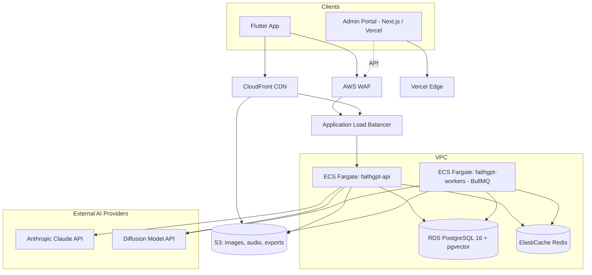

# 13 — Cloud Infrastructure

**Primary cloud:** AWS (GCP viable alternative — Cloud Run/GKE + Cloud SQL + Memorystore + GCS map 1:1 to the AWS services below).

---

## 1. Architecture Diagram

---

## 2. Compute

| Service | Role | Notes |
|---|---|---|
| ECS Fargate — `faithgpt-api` | NestJS modular monolith (§08) | Behind ALB, autoscaled on CPU + request count |
| ECS Fargate — `faithgpt-workers` | BullMQ workers: image generation, async AI generation, scheduled jobs (§08) | Autoscaled on queue depth (CloudWatch custom metric from BullMQ) |
| Vercel | Admin Portal (Next.js) | Preview deploys per PR, production on `main` |

---

## 3. Data Layer

| Service | Role |
|---|---|
| RDS PostgreSQL 16, Multi-AZ (prod) | Primary datastore (`schema.prisma`); `pgvector` extension enabled for the §06 RAG vector store |
| RDS Read Replica(s) | Bible content reads (high-volume, read-heavy) offloaded from primary at scale |
| ElastiCache Redis (cluster mode at scale) | `ScriptureAnalysisCache` mirror, entitlement/usage counters (§11 §7), BullMQ backing store, rate-limit counters |
| S3 | Generated images/PDFs, Bible audio files, data-export bundles (§12 §5) |
| CloudFront | CDN in front of S3 (immutable assets) and the API (cacheable Bible-content GETs) |

---

## 4. External AI Providers (not self-hosted at launch)

- **Anthropic Claude API** — primary LLM for all text generation (devotions, Bible Study Assistant, prayers, sermons), called from `AIGatewayModule` (§06/§08).
- **Hosted diffusion model API** (e.g., Replicate/Stability) — image generation (§19), called from `ImageGatewayService`.
- Both are external SaaS; self-hosting (e.g., on GPU-backed ECS/EKS or SageMaker) is revisited only if volume/cost modeling (§5 below) justifies the operational overhead.

---

## 5. Cost Estimates by Scale

Rough **monthly** infrastructure cost (USD), directional — excludes one-time/dev costs:

| Category | 10k MAU | 100k MAU | 1M MAU |
|---|---|---|---|
| ECS Fargate (API + workers) | $150 | $800 | $6,000 |
| RDS PostgreSQL (incl. replicas at scale) | $100 | $500 | $4,000 |
| ElastiCache Redis | $50 | $250 | $1,500 |
| S3 + CloudFront | $30 | $300 | $3,000 |
| Anthropic API (text generation) | $400 | $4,500 | $45,000 |
| Image generation API | $300 | $3,500 | $35,000 |
| Observability (Sentry, logs, Datadog) | $100 | $400 | $2,000 |
| **Total (approx.)** | **~$1,130** | **~$10,250** | **~$96,500** |

**Key takeaway:** AI provider costs (LLM + image gen) dominate at every scale (~60-65% of infra spend), which is why §11's tiered quotas and §20's pricing model are load-bearing for unit economics, not just feature differentiation.

---

## 6. Environments

| Environment | Purpose | Notes |
|---|---|---|
| `dev` | Engineering integration | Shared RDS instance (small), seeded data, mocked/low-cost AI provider tier |
| `staging` | Pre-prod validation, QA, App Store review builds | Mirrors prod topology at smaller instance sizes |
| `prod` | Live traffic | Multi-AZ RDS, autoscaled ECS, real AI provider keys with budget alerts |

Promotion: `dev` (continuous) → `staging` (on release-branch cut) → `prod` (manual approval gate in GitHub Actions).

---

## 7. CI/CD

| Pipeline | Trigger | Steps |
|---|---|---|
| Backend (`backend/`) | PR → `dev`; merge to `release/*` → `staging`; tag → `prod` | lint → unit tests → `prisma migrate deploy` (staging/prod) → build Docker image → push ECR → update ECS service |
| Mobile (`mobile/`) | PR → analyze/test; merge to `main` → build | `flutter analyze` + `flutter test` → Codemagic/Fastlane build → TestFlight / Play Internal Testing → manual promotion to production release |
| Admin Portal | Every push/PR | Vercel auto-build + preview URL; `main` → production |

---

## 8. Infrastructure as Code

Terraform modules:

| Module | Responsibility |
|---|---|
| `network` | VPC, subnets, security groups, NAT |
| `database` | RDS instance, parameter groups (incl. `pgvector`), backup config |
| `cache` | ElastiCache Redis cluster |
| `ecs-service` | Reusable module for `faithgpt-api` and `faithgpt-workers` (task def, service, autoscaling policy) |
| `s3-cdn` | S3 buckets + CloudFront distributions + bucket policies |
| `secrets` | Secrets Manager entries + IAM access policies for ECS task roles |
| `vercel-config-notes` | Documentation module (Vercel-managed, not Terraform-provisioned) for Admin Portal env vars |

Each module is environment-parameterized (`dev`/`staging`/`prod` workspaces).

---

## 9. Observability

- **Sentry**: error tracking across backend (NestJS), mobile (Flutter), and Admin Portal (Next.js).
- **CloudWatch**: infra metrics/alarms (ECS CPU/memory, RDS connections/storage, ALB 5xx rate, BullMQ queue depth via custom metrics).
- **Structured logging**: `nestjs-pino` JSON logs shipped to CloudWatch Logs → optionally forwarded to Datadog/Grafana Loki for cross-service search.
- **OpenTelemetry** traces across API → AI Gateway → external providers, for diagnosing AI latency (§01 §7 P95 targets).
- **Cost alerts**: AWS Budgets + a custom CloudWatch alarm on `AIUsageLog`-derived hourly spend (feeds Admin AI Usage Monitoring, §17).

---

## 10. Scaling Strategy

- **ECS autoscaling**: `faithgpt-api` scales on ALB request count + CPU; `faithgpt-workers` scales on BullMQ queue depth (image/AI job backlogs).
- **RDS**: vertical scaling for primary; read replicas added for Bible-content read traffic once replica lag is acceptable for the (rarely-changing) content tables.
- **Redis**: single-node → cluster mode when entitlement-check QPS or cache memory exceeds single-node limits.
- **CDN**: Bible text/audio responses are immutable and heavily cached at CloudFront edge, dramatically reducing origin load as MAU grows.

---

## 11. Disaster Recovery

| Aspect | Target |
|---|---|
| RDS backups | Automated daily snapshots + PITR, **RPO ≈ 5 minutes** |
| S3 generated assets | Cross-region replication (secondary region bucket) |
| RTO | < 1 hour for full primary-region failure, via documented runbook (restore RDS snapshot in secondary region, repoint ECS/Terraform `dev`→region var, update DNS) — **not** automated active-active multi-region at launch; revisited at 1M+ MAU scale |
| Config/secrets | Secrets Manager is multi-region-replicated by default |
