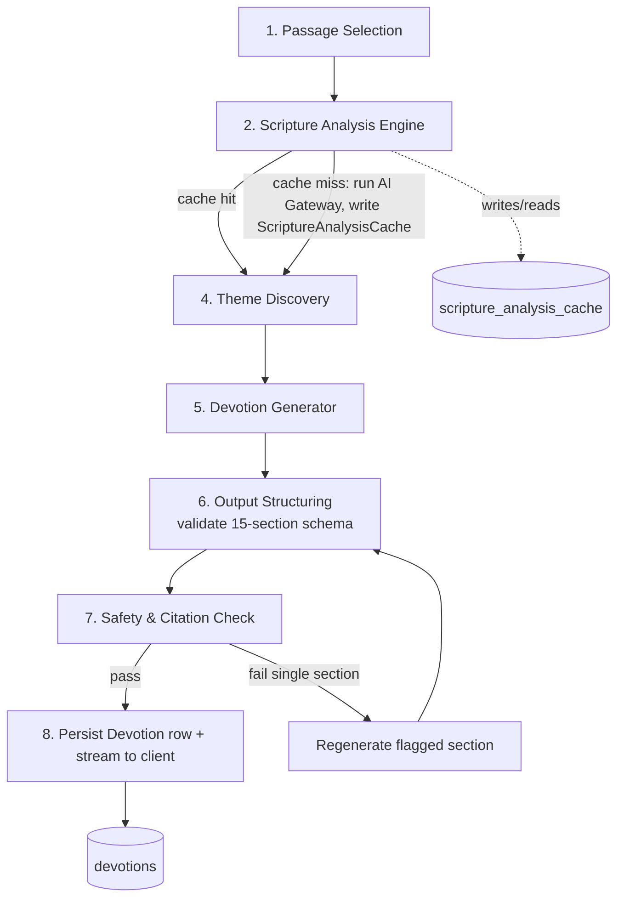
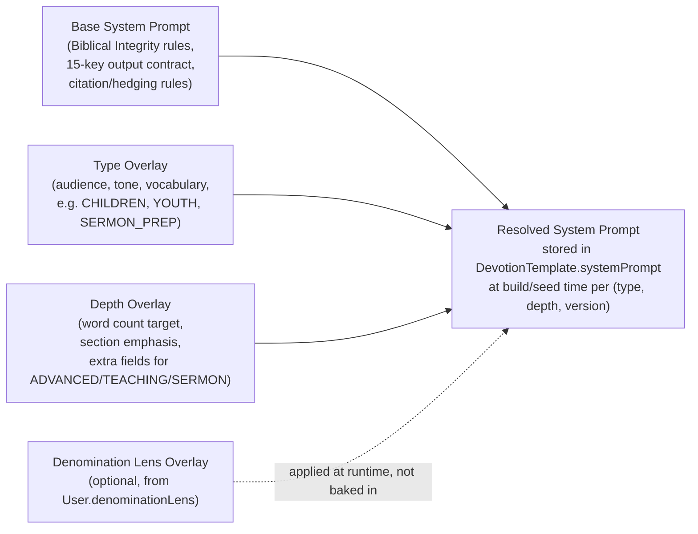
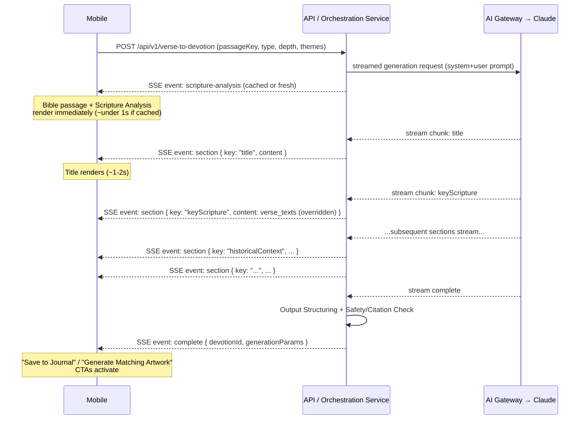

# 18 — AI Devotion Engine Design

The **AI Verse-to-Devotion Engine™** is FaithGPT's flagship feature (§01 PRD §5, #1) — it turns any Scripture selection (single verse → full passage → chapter → book) into a complete, structured devotion across 13 `DevotionType`s and 6 `DevotionDepth` levels. This document specifies the full generation pipeline, a worked example using Romans 8:28-39 (as introduced in §03 User Journeys, Journey 2), prompt template anatomy and inheritance strategy, quality assurance processes, and the streaming UX. It builds on the architecture defined in §06 (AI Gateway, RAG layer, Citation Validator, caching).

---

## 1. End-to-End Pipeline



### Stage 1 — Passage Selection

The user selects a verse, range, chapter, or passage via the Bible Reader's Selection Action Sheet (§02 IA §4) or carries over a selection from elsewhere in the app (e.g. "Generate Devotion from this answer" in Bible Study Assistant). The selection is normalized to a **`passageKey`** (e.g. `ROM.8.28-39`) and a **`versionCode`** (the user's default Bible version, e.g. `ESV`).

### Stage 2 — Scripture Analysis Engine (cache-checked)

Before any generation occurs, the Orchestration Service checks `scripture_analysis_cache` for a row matching `(passageKey, versionCode)`:

- **Cache hit**: `themes`, `elements`, and `suggestedThemes` JSON are read directly — no AI Gateway call, `AIUsageLog` row written with `costUsdMicros = 0` (§06 §7).
- **Cache miss**: the AI Gateway is called (FAST tier — §06 §3.2) with the full passage text (`verse_texts`) and a Scripture Analysis system prompt. The model returns:
  - **Themes**: tagged from the controlled vocabulary (§00 §9), each with a relevance score.
  - **Biblical Elements**: tagged per verse using `BiblicalElementType` (`COMMAND`, `PROMISE`, `WARNING`, `BLESSING`, `PROPHECY`, `FULFILLMENT`, `CHARACTER_LESSON`, `LIFE_APPLICATION`, `SPIRITUAL_PRINCIPLE`).
  - **Suggested themes**: a curated subset surfaced to the user in Stage 3 (Theme Discovery) — typically 4-6 of the highest-relevance themes, phrased as user-facing titles (e.g. "Purpose Through Pain" rather than the raw `themes.slug = "purpose"`).

  The result is written to `scripture_analysis_cache` (with `rawModelOutput` retained for debugging/QA) and to `scripture_theme_tags` / `scripture_element_tags` for per-verse indexing (used elsewhere — cross-reference graph, Community feed filters).

### Stage 3 — Theme Discovery

The `suggestedThemes` from Stage 2 are presented to the user as a multi-select chip list (§02 IA §1.3, "Theme Discovery (suggested themes, multi-select)"). The user's selection becomes part of the User Prompt (Layer 3, §06 §5.1) for Stage 5 — it directly shapes which spiritual angle the devotion emphasizes without requiring a new AI call.

### Stage 4 — Type & Depth Selection

The user selects a `DevotionType` (1 of 13) and `DevotionDepth` (1 of 6), gated by `SubscriptionTier` per §04 Feature Breakdown §3. This determines which `DevotionTemplate` row (`type`, `depth`, latest active `version`) the Prompt Assembly Engine loads.

### Stage 5 — Devotion Generator

The Prompt Assembly Engine (§06 §5.1) builds the full prompt:

1. **System Prompt** — from `DevotionTemplate.systemPrompt` (base + overlays, §4).
2. **Context Injection** — `verse_texts` for the passage, Scripture Analysis output, RAG-retrieved commentary chunks (§06 §5.3).
3. **User Prompt** — selected themes (Stage 3), `DevotionType`, `DevotionDepth`.
4. **Output Contract** — `DevotionTemplate.outputSchema`, the 15-key JSON shape (§00 §8).

The AI Gateway routes to FAST or CAPABLE tier per `DevotionDepth` (§06 §3.2) and streams the response.

### Stage 6 — Output Structuring

As each section of the JSON streams in, the Orchestration Service validates it against the canonical 15-section schema (§00 §8: `title`, `keyScripture`, `historicalContext`, `biblicalContext`, `verseExplanation`, `theologicalInsights`, `spiritualLessons`, `lifeApplications`, `reflectionQuestions`, `discussionQuestions`, `prayer`, `actionSteps`, `memoryVerse`, `relatedScriptures`, `closingEncouragement`):

- All 15 keys must be present (empty string/array permitted only for `discussionQuestions` at `QUICK`/`STANDARD` depth, where group-discussion framing is less relevant — see §4.2).
- `keyScripture` must match `verse_texts` content for the `passageKey`/`versionCode` exactly (Stage 1 enforcement of PRD §8 rule 1/7) — if the model paraphrases instead of quoting, Output Structuring substitutes the real `verse_texts` value automatically rather than failing the whole devotion.
- `memoryVerse` must resolve to a real `bible_verses` row within or referencing the passage.

### Stage 7 — Safety & Citation Check

Every reference appearing in `theologicalInsights`, `relatedScriptures`, and `memoryVerse` passes through the Citation Validator (§06 §6.1). Sections flagged for missing hedging language on disputed-topic themes (e.g. eschatological themes) trigger a single targeted regeneration of that section only — not the full devotion — to keep latency low.

### Stage 8 — Persist & Stream

On full validation pass:

- A `Devotion` row is created: `userId`, `title`, `passageKey`, `bookId`/`chapterStart`/`verseStart`/`chapterEnd`/`verseEnd` (parsed from `passageKey`), `versionCode`, `type`, `depth`, `sections` (the validated 15-key JSON), `memoryVerseRef`, `aiModel`, `generationParams` (records `templateId`, `version`, A-B variant, selected themes).
- `DevotionTheme` rows are created for each user-selected theme (§03 Journey 2: `DevotionTheme` ×2).
- `SpiritualStat.totalDevotions` increments.
- The full `sections` payload (already streamed progressively — §6) is now durable and available via "My Devotions."

---

## 2. Worked Example — Romans 8:28-39

This follows the exact flow from §03 User Journeys, Journey 2 ("Ama", 28).

### 2.1 Scripture Analysis Engine Output

```json
{
  "passageKey": "ROM.8.28-39",
  "versionCode": "ESV",
  "themes": [
    { "slug": "gods-sovereignty", "name": "God's Sovereignty", "relevance": 0.97 },
    { "slug": "hope", "name": "Hope During Difficult Times", "relevance": 0.93 },
    { "slug": "faith", "name": "Faith Under Pressure", "relevance": 0.89 },
    { "slug": "perseverance", "name": "Spiritual Perseverance", "relevance": 0.88 },
    { "slug": "trust", "name": "Trusting God's Plan", "relevance": 0.95 },
    { "slug": "purpose", "name": "Purpose Through Pain", "relevance": 0.91 }
  ],
  "elements": [
    { "type": "PROMISE", "verseRef": "ROM.8.28", "note": "All things work together for good for those who love God" },
    { "type": "BLESSING", "verseRef": "ROM.8.31-39", "note": "Nothing can separate believers from the love of God in Christ" }
  ],
  "suggestedThemes": [
    "Trusting God's Plan",
    "Purpose Through Pain",
    "Hope During Difficult Times",
    "God's Sovereignty",
    "Faith Under Pressure",
    "Spiritual Perseverance"
  ]
}
```

This is the exact row persisted to `scripture_analysis_cache` (`passageKey = "ROM.8.28-39"`, `versionCode = "ESV"`).

### 2.2 Theme Discovery — User Selection

Ama multi-selects:

- ✅ **Purpose Through Pain**
- ✅ **God's Sovereignty**

(The remaining 4 suggested themes remain unselected — they are still recorded in `scripture_analysis_cache.suggestedThemes` for future users, but only the 2 selected become `DevotionTheme` rows on Ama's `Devotion`.)

### 2.3 Type & Depth

`DevotionType = PERSONAL`, `DevotionDepth = STANDARD` (target ~400-600 words, §00 §7).

### 2.4 Representative Output Excerpt (~200 words across 3 of 15 sections)

```json
{
  "title": "When Life Doesn't Make Sense: Finding Purpose in Romans 8:28",

  "verseExplanation": "Paul isn't promising that everything that happens to us is good — Scripture is honest about suffering, loss, and injustice. Instead, he promises that God is actively weaving every circumstance, even painful ones, into His good purpose for those who love Him. The Greek word behind 'work together' (synergei) pictures things working in concert, like instruments in an orchestra. Verses 31-39 then build to one of Scripture's most sweeping assurances: no power in heaven, on earth, or in our own hearts can separate us from the love of God in Christ. This isn't passive comfort — it's a sovereign promise (PROMISE, v28) anchored in a covenant blessing (BLESSING, vv31-39) that holds even when our circumstances scream otherwise.",

  "prayer": "Lord, when my circumstances don't make sense, remind me that You are not absent — You are working. Thank You that Your love for me in Christ cannot be diminished by my failures or threatened by anything I face. Where I'm carrying pain today, help me trust Your purpose even before I can see it. Anchor my heart in Romans 8:38-39 — nothing can separate me from Your love. In Jesus' name, Amen."
}
```

The full devotion (all 15 sections, ~400-600 words at `STANDARD` depth) would also include `historicalContext` (Paul writing to a persecuted Roman church), `biblicalContext` (placement within Romans 8's argument about life in the Spirit), `theologicalInsights` citing `Romans 8:28`, `Genesis 50:20`, and `Philippians 1:6` with hedged framing where appropriate, `reflectionQuestions`/`discussionQuestions` tailored to `PERSONAL` framing, `actionSteps`, `memoryVerse` (`Romans 8:28` or `8:38-39`), `relatedScriptures`, and a `closingEncouragement`.

---

## 3. Prompt Template Anatomy — `DevotionType=PERSONAL`, `DevotionDepth=STANDARD`

The following is the structure of the active `DevotionTemplate.systemPrompt` + assembled user prompt for this combination (the `{{...}}` placeholders are filled by the Prompt Assembly Engine at Stage 5).

````
SYSTEM PROMPT
─────────────
You are the AI Verse-to-Devotion Engine™ for FaithGPT, an AI-native Christian
discipleship app. You write warm, theologically careful, denomination-neutral
devotionals for individual believers (DevotionType=PERSONAL).

TONE: Personal, encouraging, conversational but reverent. Write as a trusted
mentor speaking directly to "you," not a lecture. Avoid jargon; when a
theological or original-language term is necessary, briefly explain it.

LENGTH: Target 400-600 words total across all sections (DevotionDepth=STANDARD).
Distribute length proportionally — verseExplanation and theologicalInsights
should be the longest sections; reflectionQuestions, actionSteps, memoryVerse,
and closingEncouragement should be concise.

BIBLICAL INTEGRITY RULES (non-negotiable):
1. NEVER paraphrase or alter the text provided in [SCRIPTURE]. If you quote it,
   quote it verbatim. Treat it as fixed, licensed translation text.
2. Every claim in theologicalInsights and spiritualLessons that asserts a
   theological interpretation MUST cite a Scripture reference in the format
   "Book Chapter:Verse" (e.g. "Romans 8:28"). Only cite references that exist
   in the 66-book Protestant canon.
3. For topics where Christians historically disagree (e.g. end-times specifics,
   spiritual gifts, predestination debates), use hedging language: "many
   believers understand...", "one common reading is...", "Christians across
   traditions have interpreted this as...".
4. Do not present your commentary as Scripture. Your output will be visually
   labeled "AI-Generated Insight" — write accordingly.
5. The denomination lens, if provided below, may inform supplementary framing
   (e.g. terminology, illustrative emphasis) but MUST NOT change the meaning
   of keyScripture or contradict the plain text of [SCRIPTURE].

OUTPUT FORMAT: Return ONLY a single valid JSON object with exactly these 15
keys, in this order, and no additional keys or commentary outside the JSON:

{
  "title": string,
  "keyScripture": string,           // will be overwritten with verbatim verse_texts — write your best attempt
  "historicalContext": string,
  "biblicalContext": string,
  "verseExplanation": string,
  "theologicalInsights": string,    // must include inline [Book Chapter:Verse] citations
  "spiritualLessons": string,
  "lifeApplications": string,
  "reflectionQuestions": string[],  // 3-4 questions for personal reflection
  "discussionQuestions": string[],  // 1-2 optional questions (PERSONAL type may keep brief)
  "prayer": string,
  "actionSteps": string[],          // 2-3 concrete actions
  "memoryVerse": string,             // a single "Book Chapter:Verse" reference from or near the passage
  "relatedScriptures": string[],    // 2-4 "Book Chapter:Verse" references, cross-references only
  "closingEncouragement": string
}

USER PROMPT (assembled context)
────────────────────────────────
[SCRIPTURE — versionCode: {{versionCode}}, passageKey: {{passageKey}}]
{{scriptureText}}

[SCRIPTURE ANALYSIS]
Themes: {{analysisThemes}}
Biblical Elements: {{analysisElements}}

[USER-SELECTED THEMES FOR THIS DEVOTION]
{{selectedThemes}}

[DENOMINATION LENS]
{{denominationLensOverlay | default: "None — use denomination-neutral framing."}}

[RAG CONTEXT — grounding only, do not present as Scripture]
{{retrievedChunks}}

Generate a PERSONAL devotion at STANDARD depth (400-600 words) emphasizing the
user-selected themes above, following all rules and the output format exactly.
````

---

## 4. Template Inheritance Strategy (13 × 6 = 78 Combinations)

Rather than maintaining 78 fully independent prompts, templates are composed from a **base template** plus **per-type** and **per-depth overlays**, applied in a fixed order by the Prompt Assembly Engine:



### 4.1 Type Overlays (13 `DevotionType`s)

Each `DevotionType` overlay adjusts **audience, tone, and vocabulary** without touching the output contract:

| Type | Overlay focus |
|---|---|
| `PERSONAL` | Individual, conversational, "you"-focused (shown in §3 above) |
| `FAMILY` | Addressed to a household; application steps suggest family activities/discussion at the table |
| `YOUTH` | Contemporary language, relatable scenarios (school, social media, friendships) |
| `CHILDREN` | Simple vocabulary (reading-age ~6-10), short sentences, concrete imagery; `reflectionQuestions` phrased as simple yes/no or "what would you do" |
| `PATHFINDER` | Youth-ministry framing (SDA Pathfinder Club idiom), includes a "challenge" framing in `actionSteps` |
| `WOMEN` | Illustrative examples and applications drawn from women's life contexts |
| `MEN` | Illustrative examples and applications drawn from men's life contexts |
| `LEADERSHIP` | Frames `lifeApplications`/`actionSteps` around leading others (church, workplace, family) |
| `MARRIAGE` | Addressed to a couple; `discussionQuestions` framed for joint reflection |
| `EVANGELISTIC` | Includes a clear gospel thread and an invitational tone in `closingEncouragement` |
| `SABBATH_SCHOOL` | Structured for SDA Sabbath School format; denomination lens overlay frequently paired |
| `SMALL_GROUP` | `discussionQuestions` expanded and prioritized; includes facilitator framing notes |
| `SERMON_PREP` | Output skews toward `theologicalInsights`/`relatedScriptures` depth usable as sermon raw material; pairs naturally with `DevotionDepth=SERMON` |

### 4.2 Depth Overlays (6 `DevotionDepth` levels)

Each `DevotionDepth` overlay adjusts **target word count and section emphasis**, and for the deepest levels, **adds fields beyond the base 15** (still nested within the 15-key contract, e.g. as structured sub-content inside `theologicalInsights` or as an additional top-level `facilitatorNotes`/`originalLanguageNotes` key documented per-template):

| Depth | Word target | Overlay behavior |
|---|---|---|
| `QUICK` | ~150-250 | Compresses `historicalContext`/`biblicalContext` into 1-2 sentences each; `discussionQuestions` may be empty array |
| `STANDARD` | ~400-600 | Balanced across all 15 sections (shown in §3) |
| `DEEP` | ~900-1,400 | Expands `historicalContext`, `biblicalContext`, `theologicalInsights` significantly; `relatedScriptures` expands to 4-6 |
| `ADVANCED` | ~1,500-2,500 | Adds original-language notes (Hebrew/Greek word studies) appended to `theologicalInsights`; routed to CAPABLE model tier (§06 §3.2) |
| `TEACHING` | Structured for facilitation | Adds `facilitatorNotes` guidance woven into `discussionQuestions` and `actionSteps`; designed for `SMALL_GROUP`/`SABBATH_SCHOOL` types |
| `SERMON` | Full outline + illustrations + altar call | `theologicalInsights` restructured as sermon points; `closingEncouragement` becomes an altar-call style invitation; routed to CAPABLE tier |

### 4.3 Build & Maintenance

At template-build time (seed scripts + Admin Portal "Devotion Template Management"), the Prompt Assembly Engine resolves `BASE + TYPE[type] + DEPTH[depth]` into a single `systemPrompt` string stored per `(type, depth, version)` row in `devotion_templates`. Editing the shared `BASE` and republishing regenerates new `version` rows across all 78 combinations in one batch operation — but each combination remains independently versionable/A-B-testable thereafter (§06 §5.2), so a targeted fix to, say, `CHILDREN × QUICK` doesn't require touching the other 77.

---

## 5. Quality Assurance

### 5.1 Golden Test Set

A curated **golden test set** of ~25-40 passages with expected theme/element tags and structural assertions is maintained (e.g. `/faithgpt-platform/qa/golden-passages.json`) and run as a regression suite whenever a `BASE`, `TYPE`, or `DEPTH` overlay changes:

| Passage | `passageKey` | Expected themes (subset) | Expected elements |
|---|---|---|---|
| Romans 8:28-39 | `ROM.8.28-39` | God's Sovereignty, Hope, Trust, Purpose Through Pain | `PROMISE` (v28), `BLESSING` (v31-39) |
| Psalm 23 | `PSA.23.1-6` | Trust, Comfort, Provision | `PROMISE`, `LIFE_APPLICATION` |
| Philippians 4:6-7 | `PHP.4.6-7` | Peace, Prayer, Anxiety | `COMMAND` (v6), `PROMISE` (v7) |
| 1 Corinthians 13 | `1CO.13.1-13` | Love, Character | `SPIRITUAL_PRINCIPLE`, `CHARACTER_LESSON` |
| Joshua 1:9 | `JOS.1.9` | Courage, God's Presence | `COMMAND`, `PROMISE` |
| Genesis 3 | `GEN.3.1-24` | Sin, Consequence, Hope (Fall narrative) | `WARNING`, `PROPHECY` (v15) |

Each golden-set run asserts:
- Scripture Analysis output's `themes`/`elements` overlap the expected sets above a similarity threshold.
- Generated devotion passes Output Structuring (all 15 keys present, `keyScripture` matches `verse_texts`) and Citation Validator (all references resolve).
- Word count falls within the `DevotionDepth` target range (§00 §7) for each of the 6 depths against at least the `PERSONAL` type.
- For disputed-topic passages (e.g. eschatological texts added to the set), hedging-language markers are present.

### 5.2 Theological Review Workflow

New or changed `DevotionTemplate` versions follow this review path before `isActive = true` in production:

```mermaid
flowchart LR
    A[Content Editor drafts/edits<br/>template overlay in<br/>Admin Portal] --> B[Golden Test Set<br/>regression run — automated]
    B -->|pass| C[Theological Reviewer<br/>(CONTENT_EDITOR or designated<br/>pastoral reviewer role)<br/>reviews sample outputs<br/>across 3-5 passages]
    B -->|fail| A
    C -->|approved| D[Version marked isActive=true<br/>optionally as A-B variant]
    C -->|changes requested| A
    D --> E[Admin AI Analytics monitors<br/>quality feedback (thumbs up/down)<br/>on new version for 1-2 weeks]
    E -->|regression in feedback| F[Roll back: deactivate version,<br/>reactivate prior version]
    E -->|stable/improved| G[Promote to 100% traffic]
```

The **theological reviewer** role is a `CONTENT_EDITOR` (or a designated pastoral/theological consultant granted `CONTENT_EDITOR` access) operating through **Admin Portal → Devotion Template Management** (§02 IA §2). Review focuses on: doctrinal accuracy across denominational neutrality, appropriateness of hedging on disputed topics, tone fit for the `DevotionType` audience (especially `CHILDREN`/`YOUTH`), and citation quality (not just validity, but relevance).

---

## 6. Streaming UX — Section-by-Section SSE

To meet the non-functional requirement of **P95 < 8s for full devotion generation with content visible within ~2s** (§01 PRD §7), the 15 sections are streamed progressively as discrete SSE events rather than as one JSON blob at the end:



**Key UX details:**

- The **Scripture passage itself** (from `verse_texts`) and the **Scripture Analysis result** (themes/elements, often cache-hit) are sent as the very first SSE event(s) — these require no model generation and satisfy the "content visible within ~2s" target even before the devotion text begins streaming.
- Each of the 15 sections is emitted as its own `section` event as soon as the model completes that JSON key (the Orchestration Service parses the streaming JSON incrementally). The mobile client renders each section's card as it arrives, in canonical order, with a subtle skeleton/shimmer placeholder for not-yet-arrived sections.
- The `keyScripture` section event always carries the verbatim `verse_texts` value (Output Structuring override, §1 Stage 6) — even if the model hasn't finished generating that key yet, the client can render it immediately from data already fetched in Stage 1, reinforcing PRD §8 rule 7 ("devotion flows always open with the full passage before AI commentary").
- The Safety & Citation Check (Stage 7) runs **after** the stream completes but **before** the `complete` event — if a section requires regeneration (§1 Stage 7), the client receives an additional `section-updated` event for that key only, with a brief "Verifying citations..." indicator on that card during the gap.
- The final `complete` event carries the persisted `devotionId`, enabling "Save to Journal" (already auto-saved by default — this event activates "Generate Matching Artwork," "Share," and "Regenerate" CTAs per §02 IA §4) and `generationParams` for debugging/QA.
